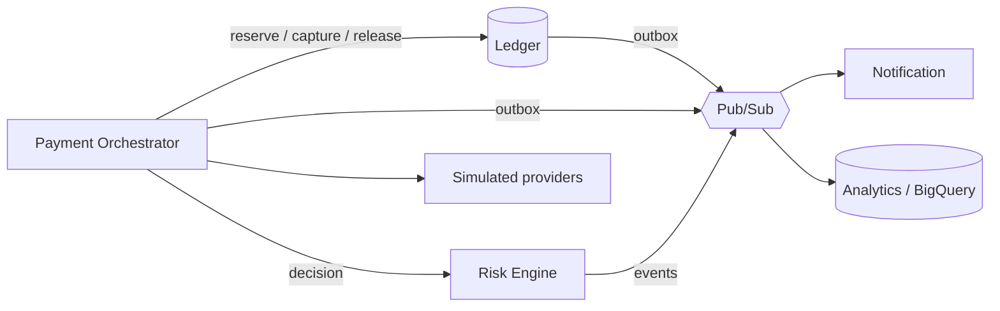
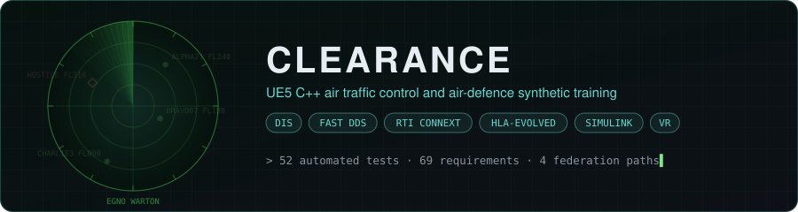
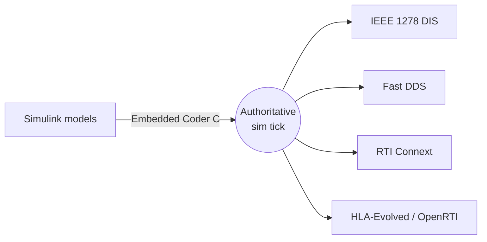

  

  
  
  

<table>
<tr>
<td width="50%" valign="top">

**About me**

- 3+ years of paid development: multiplayer systems, SQL persistence, client-server architecture
- I build systems where correctness is the point: one owner per piece of state, explicit failure handling, verification against written requirements

</td>
<td width="50%" valign="top">

**Right now**

- Final year, BA (Hons) Computer Games Design, University of South Wales, on track for a First
- Open to full-time Software Engineer roles in Cardiff, Bristol, London or remote

</td>
</tr>
</table>

<table>
<tr>
<td width="48%" valign="middle"></td>
<td width="52%" valign="middle">

A distributed payments platform built around one authoritative double-entry ledger. Only the ledger can move money; orchestration, risk, notifications and analytics sit around it behind explicit contracts, live on Google Cloud.

   

<a href="https://www.abdullahabduljabbar.com/ABS"><b>Case study</b></a> · <a href="https://github.com/abdullahabduljabbarab/abs-financial-systems"><b>Source</b></a>

</td>
</tr>
</table>

<b>Architecture and all 8 ABS repos</b>

| Repo | What it does |
| --- | --- |
| [**abs-financial-systems**](https://github.com/abdullahabduljabbarab/abs-financial-systems) | System-of-systems architecture, requirements traceability, black-box verification harness and the Engineering Portal |
| [**ledger-api**](https://github.com/abdullahabduljabbarab/ledger-api) | Python / FastAPI double-entry ledger: idempotency, reconciliation, tamper-evident history |
| [**abs-ledger-spring**](https://github.com/abdullahabduljabbarab/abs-ledger-spring) | The ledger core rebuilt on Java 21 and Spring Boot, every invariant enforced in PostgreSQL, 15 Testcontainers tests |
| [**payment-orchestrator**](https://github.com/abdullahabduljabbarab/payment-orchestrator) | Reserve / capture / release lifecycle, provider routing, timeout reconciliation and compensation |
| [**risk-engine**](https://github.com/abdullahabduljabbarab/risk-engine) | Deterministic, versioned ALLOW / REVIEW / BLOCK decisions with explainable reasons |
| [**notification-service**](https://github.com/abdullahabduljabbarab/notification-service) | Downstream email and SMS simulation with per-channel idempotency and bounded retry |
| [**analytics-service**](https://github.com/abdullahabduljabbarab/analytics-service) | BigQuery event history and CQRS projections that rebuild deterministically |
| [**platform-infrastructure**](https://github.com/abdullahabduljabbarab/platform-infrastructure) | Terraform, Workload Identity Federation and least-privilege runtime identities |

 

<table>
<tr>
<td width="48%" valign="middle"></td>
<td width="52%" valign="middle">

A C++ / Unreal Engine 5 ATC and air-defence synthetic training simulator built around one authoritative simulation state, with networked instructor and operator stations, radar and EW, replay and after-action review, and geospatial VR.

   

<a href="https://www.abdullahabduljabbar.com/CLEARANCE"><b>Case study</b></a> · <a href="https://github.com/abdullahabduljabbarab/CLEARANCE"><b>Source</b></a>

</td>
</tr>
</table>

<table>
<tr>
<td width="33%" align="center" valign="top"> <b>Final showcase</b> · 5 min</td>
<td width="33%" align="center" valign="top"> <b>Full two-role playthrough</b> · 48 min</td>
<td width="33%" align="center" valign="top"> <b>Every C++ system explained</b> · 58 min</td>
</tr>
</table>

Deep dives: <a href="https://youtu.be/u7qeIkqkt4s">DIS + DDS + RTI Connext + HLA</a> · <a href="https://youtu.be/nqjFOimsYHw">Simulink subsystems live in UE5</a>

<b>Architecture and all 5 CLEARANCE repos</b>

| Repo | What it does |
| --- | --- |
| [**CLEARANCE**](https://github.com/abdullahabduljabbarab/CLEARANCE) | UE5 C++ simulator core: aircraft behaviour, radar / GCI, instructor tooling, replay / AAR, tests and documentation |
| [**clearance-federation**](https://github.com/abdullahabduljabbarab/clearance-federation) | DIS, Fast DDS, RTI Connext and HLA-Evolved federation stack with standalone consumers |
| [**autopilot-mbd**](https://github.com/abdullahabduljabbarab/autopilot-mbd) | Simulink cascade autopilot generated to portable C with Embedded Coder |
| [**radar-mbd**](https://github.com/abdullahabduljabbarab/radar-mbd) | Pulsed-radar DSP: LFM, MVDR beamforming, matched filter, range-Doppler, CA-CFAR |
| [**missile-mbd**](https://github.com/abdullahabduljabbarab/missile-mbd) | 3-DOF proportional-navigation guidance model with generated C and documented limitations |

 

<h2 align="center">Tech stack</h2>

<table>
<tr>
<td align="right" valign="middle"><b>Languages</b></td>
<td align="left" valign="middle">   </td>
</tr>
<tr>
<td align="right" valign="middle"><b>Backend</b></td>
<td align="left" valign="middle">  </td>
</tr>
<tr>
<td align="right" valign="middle"><b>Data and messaging</b></td>
<td align="left" valign="middle">   </td>
</tr>
<tr>
<td align="right" valign="middle"><b>Cloud and DevOps</b></td>
<td align="left" valign="middle">   </td>
</tr>
<tr>
<td align="right" valign="middle"><b>Testing</b></td>
<td align="left" valign="middle"> </td>
</tr>
<tr>
<td align="right" valign="middle"><b>Simulation</b></td>
<td align="left" valign="middle">   </td>
</tr>
</table>

